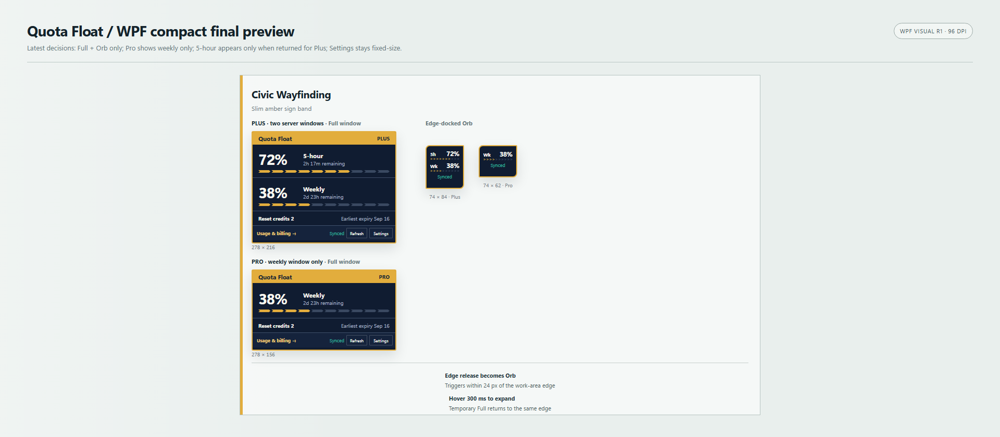

# Quote Float — WPF R1

[中文](README.md) · English

A Windows x64 quota widget for a local Codex session, built with C# / .NET 8 WPF. WPF R1 is **accepted with documented limitations**. R1 is an acceptance label, not an assigned semantic release version. No installer or binary publication is claimed.

## Current behavior

- One Civic Wayfinding interface, with Full and Orb modes and separate Chinese/English layouts.
- Supported quota windows come from the service response; the accepted snapshot requires a Weekly window. Unsupported or 5-hour-only data is treated as malformed. A missing 5-hour window produces no row; unknown quota is not displayed as zero.
- Available reset-credit count and earliest future expiry, refresh status and a Usage & billing action.
- Product Scale selects exactly 40%, 70% or 100%: 70% uses Compact Full; 40% rests as Orb and a 300 ms hover opens Compact Full. Product scale is independent of Windows DPI.
- Always-on-top, edge-to-Orb, temporary hover expansion, Settings, single-instance activation and notification-area click-through recovery.
- Refresh retains accepted quota while showing Refreshing; a request without prior quota shows Loading.

Settings stores a low-quota-alert preference; actual alert delivery is not implemented. There is no skin/theme selector, capsule mode, automatic installer or update service.

## Build and run

Use Windows x64 with the .NET 8 SDK. Run from the repository root:

```powershell
dotnet build wpf/QuotaFloat.Wpf.csproj -c Release
dotnet run --project wpf/QuotaFloat.Wpf.csproj -c Release --no-build -- --direct
```

`--direct` starts the widget independently of Codex presence. For the implemented presence-following mode, use `--watch` instead: it observes Codex and exits after three confirmed absences. It does not start Codex and is not a permanent background launcher. Changes to the follow preference take effect at the next launch. With no mode argument, the saved Follow Codex preference selects the mode (initially enabled); `--direct` takes precedence if both switches are present. The complete real close/restart scenario remains unverified.

For an account-free synthetic demo:

```powershell
dotnet run --project wpf/QuotaFloat.Wpf.csproj -c Release --no-build -- --demo-state plus --demo-language en --demo-scale 100 --demo-exit-ms 10000
```

Demo mode does not create the real quota client or Codex presence source. See [Development](docs/DEVELOPMENT.md) for tests and layout details.

## Privacy and network

The app reads local `auth.json` from the configured `CODEX_HOME` directory, or the default user-profile `.codex` directory. In real mode it uses the session token in authenticated HTTPS GET requests to the ChatGPT usage and reset-credit endpoints on `chatgpt.com`. This is network access, not an offline-only quota display. Authentication is handled by the app; it does not sign you in or modify the login file.

Billing opens the usage page in the default browser; the widget does not buy or redeem credits. Preferences are stored locally under the platform's LocalApplicationData QuotaFloat directory. Never publish login files, tokens, raw API responses, account screenshots or personal diagnostics.

## Acceptance limits

1. Same real Pro account `Fresh -> SignedOut -> Fresh` — `NOT VERIFIED / OUT OF R1 ACCEPTANCE SCOPE`.
2. Isolated Codex `Present -> close -> three absence confirmations -> Quote Float response -> restart/recovery` — `NOT VERIFIED / OUT OF R1 ACCEPTANCE SCOPE`.
3. Native Windows 125% / 120 DPI and 150% / 144 DPI runtime acceptance — `NOT VERIFIED / OUT OF R1 ACCEPTANCE SCOPE`.

Native verified baseline: Windows 100% / 96 DPI.

The 29 focused deterministic fixtures are not proof of real login/logout or Codex lifecycle completion. See the self-contained [acceptance summary](docs/wpf-r1/ACCEPTANCE-SUMMARY.md), [release notes](docs/wpf-r1/RELEASE-NOTES-R1.md) and [candidate manifest](docs/wpf-r1/CANDIDATE-MANIFEST.json).

## Design reference



The ten retained PNGs are approved static design references, not final native captures or executable downloads. Historical Settings images show a 40–180 slider; the later accepted discrete 40/70/100 scale and Minimal Refreshing contracts supersede affected historical control/status details.

## Legacy and attribution

`native/` is the historical WinForms implementation. WPF owns its three shared source copies and builds without the native directory. Existing legacy changes are outside the WPF R1 publication selection.

[MIT license](LICENSE) remains unchanged. [Third-party notices](THIRD_PARTY_NOTICES.md) have been updated for WPF R1: the `native/` WinForms implementation is identified as historical, while upstream attribution and license notices are retained.

This is an unofficial project, not affiliated with or endorsed by OpenAI.
