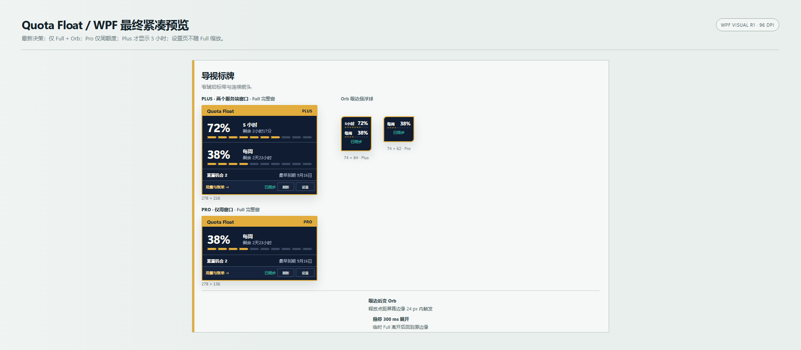

# Quote Float — WPF R1

中文 · [English](README.en.md)

基于 C# / .NET 8 WPF 的 Windows x64 额度浮窗，读取本机 Codex 会话。WPF R1 已按明确限制完成验收；R1 是验收标识，不是已指定的语义版本号。本文不表示安装器或二进制 Release 已发布。

## 当前功能

- 单一 Civic Wayfinding 界面，Full 与 Orb 两种形态，独立的中英文布局。
- 按服务端实际返回的受支持额度窗口显示；当前接受的快照必须含 Weekly 窗口，不支持或只有 5 小时窗口的数据按格式错误处理；没有 5 小时窗口就没有该行，未知额度不显示为零。
- 显示可用重置机会、最早有效到期时间、同步状态，并提供 Usage & billing 入口。
- 产品比例只有 40%、70%、100% 三档：70% 为紧凑 Full；40% 常驻 Orb，悬停 300 ms 展开紧凑 Full。产品比例与 Windows DPI 分开处理。
- 支持置顶、贴边变球、临时悬停展开、设置、单实例激活，以及通知区域的鼠标穿透恢复入口。
- 已有额度时刷新保留内容并显示“刷新中”；没有历史额度时请求显示 Loading。

设置中仅保存低额度提醒偏好；实际提醒投递尚未实现。没有皮肤/主题选择器、胶囊形态、自动安装器或自动更新服务。

## 构建与运行

需要 Windows x64 与 .NET 8 SDK。在仓库根目录运行：

```powershell
dotnet build wpf/QuotaFloat.Wpf.csproj -c Release
dotnet run --project wpf/QuotaFloat.Wpf.csproj -c Release --no-build -- --direct
```

`--direct` 不依赖 Codex 是否出现；改用 `--watch` 可启用已实现的跟随模式，在连续三次确认 Codex 缺席后退出。它不会启动 Codex，也不是永久后台启动器。更改跟随偏好在下次启动生效。不传模式时使用“跟随 Codex”保存偏好（初始开启）；同时传两个参数时 `--direct` 优先。真实关闭与重启的完整场景仍未验证。

无需账号的合成演示：

```powershell
dotnet run --project wpf/QuotaFloat.Wpf.csproj -c Release --no-build -- --demo-state plus --demo-language zh --demo-scale 100 --demo-exit-ms 10000
```

演示模式不会创建真实额度客户端或 Codex 进程观察源。测试说明见[开发文档](docs/DEVELOPMENT.md)。

## 隐私与网络

真实模式由应用读取 `CODEX_HOME` 指向目录中的 `auth.json`，未配置时读取用户目录下的默认 `.codex` 登录文件。应用使用会话 token，通过经过认证的 HTTPS GET 请求访问 `chatgpt.com` 的额度与重置机会接口，因此不是纯离线显示。应用不会替你登录或修改登录文件。

Billing 用默认浏览器打开额度页面；浮窗不购买或兑换重置机会。偏好保存在系统 LocalApplicationData 的 QuotaFloat 目录。不要公开登录文件、token、原始接口响应、账户截图或个人诊断。

## 验收限制

以下三项全部为 `NOT VERIFIED / OUT OF R1 ACCEPTANCE SCOPE`：

1. 同一真实 Pro 账户 `Fresh -> SignedOut -> Fresh`。
2. 隔离 Codex 的 `Present -> close -> three absence confirmations -> Quote Float response -> restart/recovery`。
3. 原生 Windows 125% / 120 DPI 与 150% / 144 DPI 运行验收。

已原生验证的基线为 Windows 100% / 96 DPI。29 项确定性 fixture 通过，不代表真实登录/退出或完整 Codex 生命周期已经验证。详见[验收摘要](docs/wpf-r1/ACCEPTANCE-SUMMARY.md)、[发行说明](docs/wpf-r1/RELEASE-NOTES-R1.md)与[候选清单](docs/wpf-r1/CANDIDATE-MANIFEST.json)。

## 设计参考



保留的十张 PNG 是获批静态设计参考，不是最终原生运行截图或可执行程序下载。历史设置图仍画有 40–180 滑块；后续获批的 40/70/100 三档比例及 Minimal Refreshing 规则，覆盖相关历史控件与状态细节。

## 历史实现与署名

`native/` 是历史 WinForms 实现。WPF 自有三份共享逻辑副本，构建不再依赖 native 目录；原有 legacy 修改不在本次发布选择中。

[MIT 许可证](LICENSE)保持不变。[第三方声明](THIRD_PARTY_NOTICES.md)已更新以反映 WPF R1：`native/` WinForms 被明确标为历史实现，同时保留上游项目署名与许可证声明。

本项目非 OpenAI 官方产品，未获其背书。
