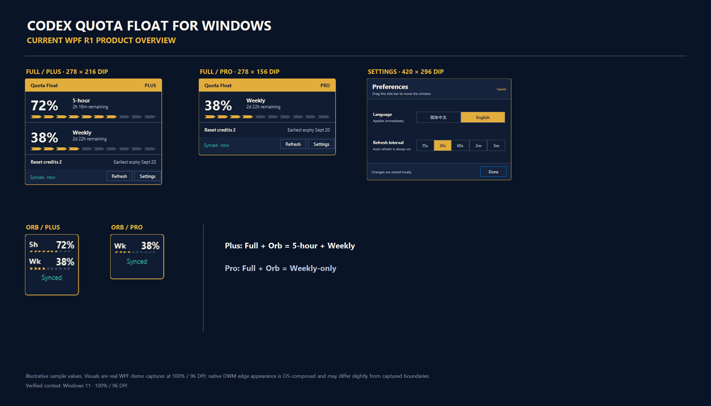

# Codex Quota Float for Windows

**Language / 语言:** English (current) · [简体中文](README.zh-CN.md)

> A local-first native Windows WPF widget that keeps your Codex Plus/Pro quota visible in compact Full or Orb views.




_Illustrative sample values; visuals are real WPF demo captures at 100% / 96 DPI; native DWM edge appearance is OS-composed and may differ slightly from captured boundaries._

## Latest download

**[Latest Release](https://github.com/keida/codex-quota-float/releases/latest)** · v1.1.2 · [Download the self-contained Windows x64 EXE](https://github.com/keida/codex-quota-float/releases/download/v1.1.2/Quote-Float-v1.1.2-win-x64.exe) · [Download SHA256SUMS.txt](https://github.com/keida/codex-quota-float/releases/download/v1.1.2/SHA256SUMS.txt)

Run `Quote-Float-v1.1.2-win-x64.exe` directly. No separate .NET installation is required. Verify the SHA-256 from `SHA256SUMS.txt` before running it. This build is currently unsigned, so Windows Defender SmartScreen may warn on first run; use the official release link above, verify the hash, and follow your Windows or organization policy. Do not bypass a security warning blindly.

## Core features

- **Codex-only companion:** works with the installed Codex Desktop app, can launch it when needed or observe its presence, and never closes it.
- **Full and Orb:** keep Plus or Pro quota visible, with edge placement, hover expansion, tray recovery, and topmost behavior from the WPF R1 contract.
- **English / 中文:** switch the UI and tray menu language from Settings; the selection is stored locally.
- **Local-first:** quota data is fetched only for the supported Codex usage and reset-credit views, with no chat-content collection or product analytics endpoint in the current source.

## Windows requirements

- Windows x64 with the Codex Desktop app installed when using LaunchAndWatch.
- Native baseline verified at Windows 100% / 96 DPI.
- Windows 125% / 150% native DPI runtime acceptance remains **NOT VERIFIED / OUT OF R1 ACCEPTANCE SCOPE**.
- The published v1.1.2 EXE is self-contained; no separate .NET installation is required.

## Privacy promise, bounded by the source

Quote Float reads the local Codex `auth.json` under `CODEX_HOME` or the user's `.codex` directory only to obtain the access token and account-routing identifier needed for quota requests. It sends authenticated GET requests only to:

- `https://chatgpt.com/backend-api/wham/usage`
- `https://chatgpt.com/backend-api/wham/rate-limit-reset-credits`

The current source does not read chat content, define a telemetry or analytics endpoint, or write the Codex token to Quote Float preferences. Quote Float stores its language and refresh-interval preferences locally at `%LOCALAPPDATA%\QuotaFloat\preferences.json`. Optional Edge Drag diagnostics are off by default; only `QF_EDGE_DRAG_LOG` writes to the user-selected local file. That file may include timestamps, window/display bounds, and window handles; it is never auto-uploaded. Inspect and redact it before public sharing. Never attach `auth.json`, tokens, cookies, raw responses, account screenshots, or private diagnostics to a public issue.

## Verify the download

From the folder containing the downloaded EXE and `SHA256SUMS.txt`:

```powershell
$line = Get-Content .\SHA256SUMS.txt | Where-Object { $_ -match 'Quote-Float-v1.1.2-win-x64\.exe$' }
$expected = ($line -split '\s+')[0]
$actual = (Get-FileHash .\Quote-Float-v1.1.2-win-x64.exe -Algorithm SHA256).Hash
if ($actual -ne $expected) { throw 'Checksum mismatch' }
"SHA-256 OK: $actual"
```

## Quick start

1. Download the EXE and `SHA256SUMS.txt` from the official [Latest Release](https://github.com/keida/codex-quota-float/releases/latest).
2. Verify the EXE with the PowerShell snippet above.
3. Run the EXE. Use `--direct` to start the widget independently, or `--watch` to observe Codex without launching it. With no mode flag, the approved LaunchAndWatch behavior is used.

## Product contract

- Settings is a fixed `420 × 296 DIP` non-modal window. The user-selectable settings are language and refresh interval; Done closes the window.
- Saved/explanatory notes are not a settings status. Settings has no Refresh button; the sole manual Refresh action is in the Full footer. Auto Refresh is always on.
- Refreshing retains accepted quota; without a prior snapshot, the active request shows Loading.
- R1 excludes Product Scale, Billing/Usage navigation, the Auto Refresh toggle, Click-through, and theme/behavior selectors.

## Technical verification

- [Public roadmap](ROADMAP.md)
- [Acceptance summary](docs/wpf-r1/ACCEPTANCE-SUMMARY.md)
- [Release notes](docs/wpf-r1/RELEASE-NOTES-R1.md)
- [Development guidance](docs/DEVELOPMENT.md)
- [Current candidate manifest](docs/wpf-r1/CANDIDATE-MANIFEST.json)
- [Security reporting](SECURITY.md)
- [License](LICENSE)
- [Third-party notices](THIRD_PARTY_NOTICES.md)

[](https://github.com/keida/codex-quota-float/actions/workflows/wpf-ci.yml)

The current v1.1.2 release passed the WPF Release build and deterministic suite. The following remain explicitly **NOT VERIFIED / OUT OF R1 ACCEPTANCE SCOPE**:

1. The same real Pro account `Fresh -> SignedOut -> Fresh`.
2. Isolated Codex `Present -> close -> three absence confirmations -> Quote Float response -> restart/recovery`.
3. Native Windows 125% / 150% DPI runtime acceptance.

## Repository layout

- `wpf/`: current WPF product implementation and WPF tests.
- `docs/`: public technical records, contracts, acceptance evidence, and release records.
- `native/`: historical WinForms implementation kept for reference; it is not the current product implementation.

OpenAI, Codex, Microsoft, and Windows names identify compatibility targets; no affiliation or endorsement is implied. The v1.1.2 release is the current Latest Release; v1.1.0 is the prior published release, while the v1.1.1 tag is unpublished and superseded.
