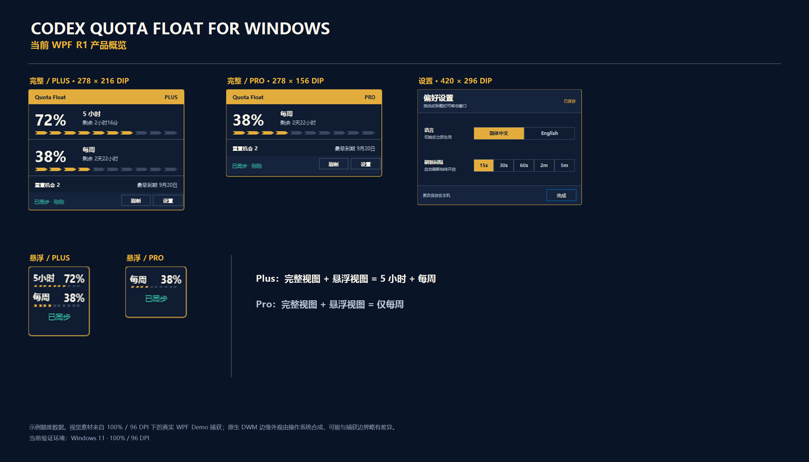
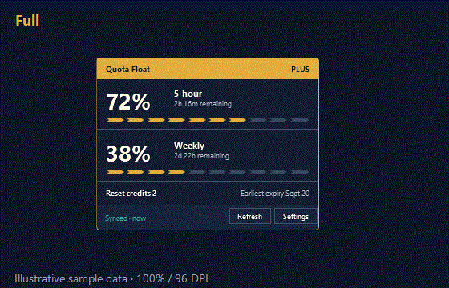

# Codex Quota Float for Windows

**语言 / Language:** [English](README.md) · 简体中文（当前）

> 一个本地优先的原生 Windows WPF 浮窗，让你的 Codex Plus/Pro 额度以紧凑的完整窗口或悬浮球保持可见。





_额度数值为示例；视觉素材来自 100% / 96 DPI 下的真实 WPF Demo 捕获；原生 DWM 边缘外观由操作系统合成，可能与捕获边界略有差异。_

## 最新下载

**[Latest Release](https://github.com/keida/codex-quota-float/releases/latest)** · v1.1.2 · [下载自包含 Windows x64 EXE](https://github.com/keida/codex-quota-float/releases/download/v1.1.2/Quote-Float-v1.1.2-win-x64.exe) · [下载 SHA256SUMS.txt](https://github.com/keida/codex-quota-float/releases/download/v1.1.2/SHA256SUMS.txt)

直接运行 `Quote-Float-v1.1.2-win-x64.exe`，无需单独安装 .NET。运行前请先用 `SHA256SUMS.txt` 校验 SHA-256。当前版本未进行代码签名，Windows Defender SmartScreen 首次运行时可能显示警告；请使用上面的官方 Release 链接、完成哈希校验，再遵循你的 Windows 或组织安全策略，不要盲目绕过安全警告。

## 核心功能

- **Codex 专用伴侣：**与已安装的 Codex Desktop 配合工作，需要时可以启动它，也可以只观察它的状态，并且不会关闭它。
- **完整窗口与悬浮球：**持续显示 Plus 或 Pro 额度，并保留 WPF R1 的边缘定位、悬停展开、托盘恢复和置顶行为。
- **English / 中文：**在设置中切换界面和托盘菜单语言；选择保存在本机。
- **本地优先：**只为受支持的 Codex usage 与 reset-credit 视图获取额度数据；当前源码不采集聊天内容，也没有产品分析 endpoint。

## Windows 要求

- Windows x64；使用 LaunchAndWatch 时需要安装 Codex Desktop。
- 已验证的原生基线是 Windows 100% / 96 DPI。
- Windows 125% / 150% 原生 DPI 运行验收仍为 **NOT VERIFIED / OUT OF R1 ACCEPTANCE SCOPE**。
- 已发布的 v1.1.2 EXE 是自包含版本，无需单独安装 .NET。

## 隐私承诺（以源码边界为准）

Quote Float 从 `CODEX_HOME` 或用户 `.codex` 目录下的本地 Codex `auth.json` 读取 access token 与账户路由标识，仅用于额度请求。它只向以下 endpoint 发送带身份验证的 GET 请求：

- `https://chatgpt.com/backend-api/wham/usage`
- `https://chatgpt.com/backend-api/wham/rate-limit-reset-credits`

当前源码不读取聊天内容，不定义 telemetry 或 analytics endpoint，也不会把 Codex token 写入 Quote Float 偏好设置。Quote Float 会在本机 `%LOCALAPPDATA%\QuotaFloat\preferences.json` 保存语言和刷新间隔偏好。可选的 Edge Drag 诊断默认关闭；只有设置 `QF_EDGE_DRAG_LOG` 才会写入用户选择的本地文件。该文件可能包含时间戳、窗口/显示器边界和窗口句柄；不会自动上传。公开分享前请先检查并脱敏。不要在公开 issue 中附加 `auth.json`、token、cookie、原始响应、账户截图或私人诊断信息。

## 校验下载

在下载的 EXE 与 `SHA256SUMS.txt` 所在目录运行：

```powershell
$line = Get-Content .\SHA256SUMS.txt | Where-Object { $_ -match 'Quote-Float-v1.1.2-win-x64\.exe$' }
$expected = ($line -split '\s+')[0]
$actual = (Get-FileHash .\Quote-Float-v1.1.2-win-x64.exe -Algorithm SHA256).Hash
if ($actual -ne $expected) { throw 'Checksum mismatch' }
"SHA-256 OK: $actual"
```

## 快速开始

1. 从官方 [Latest Release](https://github.com/keida/codex-quota-float/releases/latest) 下载 EXE 与 `SHA256SUMS.txt`。
2. 使用上面的 PowerShell 片段校验 EXE。
3. 运行 EXE。使用 `--direct` 独立启动浮窗，使用 `--watch` 只观察 Codex 而不启动它。不带模式参数时使用已批准的 LaunchAndWatch 行为。

## 产品契约

- Settings 是固定 `420 × 296 DIP` 的非模态窗口；用户可选择语言和刷新间隔，Done 用于关闭窗口。
- 已保存/说明文字不是设置状态。Settings 没有 Refresh 按钮；唯一的手动 Refresh 在 Full 页脚。Auto Refresh 始终开启。
- 刷新会保留已有额度；没有已有快照时，活动请求显示 Loading。
- R1 不包含 Product Scale、Billing/Usage 导航、Auto Refresh 开关、Click-through 或主题/行为选择器。

## 技术验收

- [公开 Roadmap](ROADMAP.md)
- [验收摘要](docs/wpf-r1/ACCEPTANCE-SUMMARY.md)
- [发布说明](docs/wpf-r1/RELEASE-NOTES-R1.md)
- [开发说明](docs/DEVELOPMENT.md)
- [当前候选 manifest](docs/wpf-r1/CANDIDATE-MANIFEST.json)
- [安全报告](SECURITY.md)
- [许可证](LICENSE)
- [第三方说明](THIRD_PARTY_NOTICES.md)

[](https://github.com/keida/codex-quota-float/actions/workflows/wpf-ci.yml)

当前 v1.1.2 版本已通过 WPF Release 构建与确定性测试。以下事项仍明确保持 **NOT VERIFIED / OUT OF R1 ACCEPTANCE SCOPE**：

1. 同一真实 Pro 账户 `Fresh -> SignedOut -> Fresh`。
2. 隔离 Codex `Present -> close -> three absence confirmations -> Quote Float response -> restart/recovery`。
3. 原生 Windows 125% / 150% DPI 运行验收。

## 仓库结构

- `wpf/`：当前 WPF 产品实现及 WPF 测试。
- `docs/`：公开技术记录、契约、验收证据和发布记录。
- `native/`：保留作参考的历史 WinForms 实现，不是当前产品实现。

OpenAI、Codex、Microsoft 和 Windows 名称仅用于说明兼容目标；不代表任何关联或背书。v1.1.2 是当前 Latest Release；v1.1.0 是此前的已发布版本，v1.1.1 tag 未发布且已被取代。
